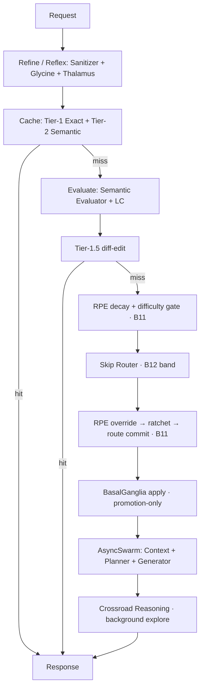

# CORTEX 1.0(5.0) OVERTURE

[한국어](./README.md) | **English**

**Cognitive Orchestration Runtime for Task EXecution**

> CORTEX does not simply forward LLM requests as plain calls. Instead, every request
> flows through **input refinement → semantic evaluation → difficulty-based routing →
> asynchronous multi-agent execution → goal memory → reward-prediction-error (RPE)
> learning → action-candidate advice** — a **cognitive orchestration runtime**. It models
> biological cognitive structures (thalamus, basal ganglia, prefrontal cortex, dopamine,
> norepinephrine, glia, and more) as software *organs*, processing each request along a
> neural path of "reflex → evaluation → learning."

[](./LICENSE)


> ⚖️ **Patent Pending** — The core technology of this project has been filed with the
> Korean Intellectual Property Office. **Application No. 10-2026-0117851** (filed
> 2026-06-28). See [License & Patent](#license--patent) below for details.

---

## Core Principle — The Honesty Invariant

> **"If it isn't live, never make it look live / never invent a signal."**

All learning and advisory signals are derived solely from real runtime observations.
Approximated or synthesized fake signals are never injected; this is enforced at the
code level through static isolation checks and the determinism / no-invention assertions
of the measurement harness.

---

## Current Status

- **Version:** CORTEX 5.0 OVERTURE (v1.0 feature-complete)
- **Full regression:** 2,051 passed / 0 failed (single process)
- **Gates active:**
  - ✅ RPE 35-slot difficulty learning (real-time learning, with automatic rollback, time
    decay, and persistent safety guards)
  - ✅ Crossroad Reasoning explore (background exploration on neck-and-neck routing)
  - ✅ BasalGanglia apply (promotion-only — structurally blocks quality-degradation risk)

For detailed organ composition, dependencies, run instructions, and statistics, see the
canonical documents:
- 📄 [Architecture (canonical)](./docs/CORTEX_5_0_OVERTURE_ARCHITECTURE.md)
- 📊 [Metrics (code · commits · tests)](./docs/CORTEX_5_0_OVERTURE_METRICS.md)
- 📜 [OVERTURE progress log](./OVERTURE_VERSION_HISTORY.md)

---

## Processing Flow



---

## Organ Composition (summary)

**New in OVERTURE (13 modules):** Difficulty Store/Gate/Learner, RPE Route Override,
Routing Ratchet/Decay, RPE Record/Preset Store, Rollback Scheduler, Glymphatic Cleaner,
Crossroad Reasoner, RPE Recent Counter, Cache Key.

**Existing from AEV (wired / activated / redesigned in OVERTURE):** BasalGanglia Advisor,
Synapse, RPE Core, Tier-1.5, LC · PFC · Skip Router · Evaluator, Slot Registry.

**Pure AEV skeleton:** Ingress (Sanitizer · Thalamus · Cache), Execution (AsyncSwarm ·
Context · Planner · Generator · GABA), Memory (Goal · IFOM), Maintenance (PLC), Core (e5
Embedder · Logger · Model Tier).

For the full list and the AEV/OVERTURE breakdown, see
[Architecture (canonical) §1](./docs/CORTEX_5_0_OVERTURE_ARCHITECTURE.md).

---

## Installation & Running

> All secret keys are injected by environment-variable **name** only. Key **values** live
> nowhere in the repository.

**Requirements:** Python 3.11. Runtime footprint ~2.4 GB (including PyTorch ~496 MB and the
multilingual e5 model ~1.06 GB).

**Install:**
```bash
python3.11 -m venv .venv
# Windows
.venv\Scripts\pip install -e ".[dev]"
# macOS / Linux
.venv/bin/pip install -e ".[dev]"
```
(`pyproject.toml` is the single source of truth.)

**Run:**
```bash
uvicorn app.main:app --host 0.0.0.0 --port 8000 --reload
```

**LLM mode:** Environment variable `CORTEX_LLM_MODE` (default `mock`, switch to `live`).
Per-slot LLM API keys are injected from `.env` under the env name specified by `api_key_env`
in `config/tier_slots.json`. (See `.env.example`.)

**Gate environment variables:**

| Env var | Default | Meaning |
|---|---|---|
| `RPE_DIFFICULTY_LEARNING_ENABLED` | True | 35-slot RPE difficulty learning |
| `CR_ENABLED` | True | Crossroad Reasoning explore |
| `BG_APPLY_ENABLED` | True | BasalGanglia promotion-only apply |
| `GLYMPHATIC_ENABLED` | False | Periodic cleanup (opt-in) |

---

## Tests

```bash
pytest tests/
```
Single-process full regression: 2,051 passed. Categories: unit / integration · smoke /
isolation (AST import) / regression / measurement harness (zero signal invention ·
determinism assertions) / wiring / lifecycle. For details, see the
[Metrics document](./docs/CORTEX_5_0_OVERTURE_METRICS.md).

---

## Roadmap (summary)

The Core is kept cold and stable, with expansion planned via feature-specific
microservices (**CORTEX Suite**).

- **CORTEX Lens** — multimodal artifact ingestion (files · images · tables → Evidence
  Packet + Vector Memory)
- **CORTEX Mirror** — persona / interface alignment (factual, safety, and routing decisions
  stay in the Core)
- **CORTEX Atlas / NeuroScope / Relay / Sentinel / Go** — enterprise knowledge seeding ·
  observability · model routing · security guardrails · general-user wrapper

We are also reviewing the re-examination and enhancement of AEV organs such as Thalamus,
Tier-1.5, and Norepinephrine, along with a lightweight version. For the full vision, see
[Architecture (canonical) §5](./docs/CORTEX_5_0_OVERTURE_ARCHITECTURE.md).

---

## License & Patent

This project is distributed under the [Apache License 2.0](./LICENSE).

⚖️ **Patent Pending.** The core technology of this project (reward-prediction-error-based
(category × difficulty) learning, bidirectional biomimetic routing, monotonic ratchet /
time-decay safety guards, Crossroad Reasoning, promotion-only action advice, and more) has
been filed with the Korean Intellectual Property Office. **Application No. 10-2026-0117851**
(filed 2026-06-28).

The Apache License 2.0 includes an explicit patent-license clause in its text. Rights
regarding code use follow Apache 2.0; for separate inquiries about the filed patent, please
contact the repository owner.

---

<sub>CORTEX 5.0 OVERTURE · Developed by Minnabi (민나비) · 2026</sub>
