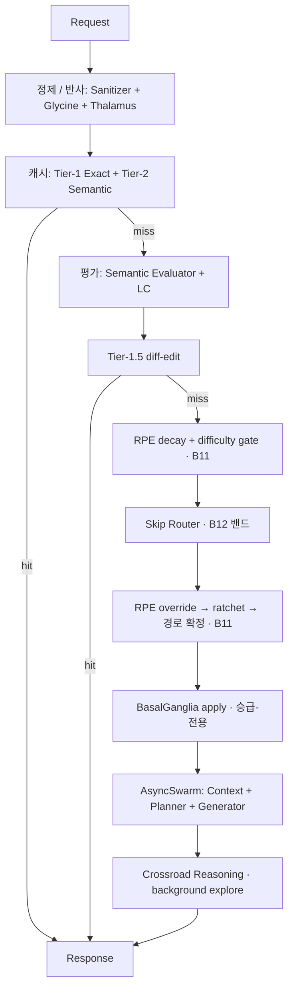

# CORTEX 1.0(5.0) OVERTURE

**한국어** | [English](./README.en.md)

**Cognitive Orchestration Runtime for Task EXecution**

> CORTEX는 LLM 요청을 단순 호출로 흘려보내지 않고, **입력 정제 → 의미 평가 → 난이도 기반 라우팅
> → 비동기 다중 에이전트 실행 → 목표 기억 → 보상예측오차(RPE) 학습 → 행동 후보 조언**까지 거치는
> **인지형 실행 런타임(cognitive orchestration runtime)**입니다. 생물학적 인지 구조(시상·기저핵·
> 전전두엽·도파민·노르에피네프린·교세포 등)를 소프트웨어 기관(organ)으로 모델링하여, 각 요청을
> "반사 → 평가 → 학습"의 신경 경로처럼 처리합니다.

[](./LICENSE)


> ⚖️ **특허 출원 중 (Patent Pending)** — 본 프로젝트의 핵심 기술은 대한민국 특허청에 출원되어
> 있습니다. **출원번호 10-2026-0117851** (출원일 2026-06-28). 자세한 내용은 아래 [라이선스 및
> 특허](#라이선스-및-특허) 참조.

---

## 핵심 원칙 — 정직성 불변식

> **"live가 아니면 live처럼 보이게 하지 않는다 / 신호를 발명하지 않는다."**

모든 학습·조언 신호는 실제 런타임 관측에서만 도출됩니다. 근사·합성된 가짜 신호를 주입하지 않으며,
이는 정적 격리 검사 및 측정 하네스의 결정론·비발명 단언으로 코드 레벨에서 강제됩니다.

---

## 현재 상태

- **버전:** CORTEX 5.0 OVERTURE (v1.0 feature-complete)
- **전체 회귀:** 2,051 passed / 0 failed (단일 프로세스)
- **게이트 활성화:**
  - ✅ RPE 35칸 난이도 학습 (실시간 학습, 자동 rollback·시간 감쇠·영속 안전장치 완비)
  - ✅ Crossroad Reasoning explore (막상막하 라우팅에서 background 탐색)
  - ✅ BasalGanglia apply (승급-전용 — 품질 저하 위험 구조적 차단)

상세한 기관 구성·의존성·구동법·통계는 정본 문서를 참조하세요:
- 📄 [아키텍처 정본](./docs/CORTEX_5_0_OVERTURE_ARCHITECTURE.md)
- 📊 [통계 (코드·커밋·테스트)](./docs/CORTEX_5_0_OVERTURE_METRICS.md)
- 📜 [OVERTURE 진행 로그](./OVERTURE_VERSION_HISTORY.md)

---

## 처리 흐름



---

## 기관 구성 (요약)

**OVERTURE 신규 (13개 모듈):** Difficulty Store/Gate/Learner, RPE Route Override, Routing
Ratchet/Decay, RPE Record/Preset Store, Rollback Scheduler, Glymphatic Cleaner, Crossroad
Reasoner, RPE Recent Counter, Cache Key.

**AEV 기존 (OVERTURE에서 배선·활성화·재설계):** BasalGanglia Advisor, Synapse, RPE Core,
Tier-1.5, LC·PFC·Skip Router·Evaluator, Slot Registry.

**순수 AEV 골격:** Ingress(Sanitizer·Thalamus·Cache), Execution(AsyncSwarm·Context·Planner·
Generator·GABA), Memory(Goal·IFOM), Maintenance(PLC), Core(e5 Embedder·Logger·Model Tier).

전체 목록과 AEV/OVERTURE 구분은 [아키텍처 정본 §1](./docs/CORTEX_5_0_OVERTURE_ARCHITECTURE.md)
참조.

---

## 설치 및 구동

> 모든 비밀 키는 환경변수 **이름**으로만 주입됩니다. 키 **값**은 저장소 어디에도 없습니다.

**요구사항:** Python 3.11. 런타임 풋프린트 약 2.4 GB (PyTorch ~496 MB, 다국어 e5 모델 ~1.06 GB 포함).

**설치:**
```bash
python3.11 -m venv .venv
# Windows
.venv\Scripts\pip install -e ".[dev]"
# macOS / Linux
.venv/bin/pip install -e ".[dev]"
```
(`pyproject.toml`이 단일 진실 공급원입니다.)

**기동:**
```bash
uvicorn app.main:app --host 0.0.0.0 --port 8000 --reload
```

**LLM 모드:** 환경변수 `CORTEX_LLM_MODE` (기본 `mock`, `live`로 전환). 슬롯별 LLM API 키는
`config/tier_slots.json`의 `api_key_env`가 지정하는 env 이름으로 `.env`에서 주입합니다.
(`.env.example` 참조.)

**게이트 환경변수:**

| 환경변수 | 기본값 | 의미 |
|---|---|---|
| `RPE_DIFFICULTY_LEARNING_ENABLED` | True | 35칸 RPE 난이도 학습 |
| `CR_ENABLED` | True | Crossroad Reasoning explore |
| `BG_APPLY_ENABLED` | True | BasalGanglia 승급-전용 apply |
| `GLYMPHATIC_ENABLED` | False | 주기 청소(opt-in) |

---

## 테스트

```bash
pytest tests/
```
단일 프로세스 전체 회귀 2,051 passed. 종류: 단위 / 통합·스모크 / 격리(AST import) / 회귀 /
측정 하네스(신호 발명 0·결정론 단언) / 배선 / 수명주기. 상세는
[통계 문서](./docs/CORTEX_5_0_OVERTURE_METRICS.md) 참조.

---

## 로드맵 (요약)

Core는 차갑고 안정적으로 유지하고, 기능별 마이크로서비스(**CORTEX Suite**)로 확장할 계획입니다.

- **CORTEX Lens** — 멀티모달 artifact ingestion (파일·이미지·표 → Evidence Packet + Vector Memory)
- **CORTEX Mirror** — 페르소나·인터페이스 정렬 (사실·안전·라우팅 판단은 Core 유지)
- **CORTEX Atlas / NeuroScope / Relay / Sentinel / Go** — 기업 지식 시딩 · 관측성 · 모델 라우팅 ·
  보안 가드레일 · 일반 사용자용 래퍼

또한 Thalamus·Tier-1.5·Norepinephrine 등 AEV 기관의 재점검·고도화, 경량화 버전을 검토 중입니다.
전체 비전은 [아키텍처 정본 §5](./docs/CORTEX_5_0_OVERTURE_ARCHITECTURE.md) 참조.

---

## 라이선스 및 특허

본 프로젝트는 [Apache License 2.0](./LICENSE) 하에 배포됩니다.

⚖️ **특허 출원 중 (Patent Pending).** 본 프로젝트의 핵심 기술(보상예측오차 기반 (카테고리 ×
난이도) 학습, 양방향 생체모방 라우팅, 단조 래칫·시간 감쇠 안전장치, Crossroad Reasoning, 승급-전용
행동 조언 등)은 대한민국 특허청에 출원되어 있습니다. **출원번호 10-2026-0117851** (출원일
2026-06-28).

Apache License 2.0은 라이선스 본문에 명시적 특허 라이선스 조항을 포함합니다. 코드 사용에 관한
권리는 Apache 2.0을 따르되, 출원된 특허에 관한 별도 문의는 저장소 소유자에게 연락 바랍니다.

---

<sub>CORTEX 5.0 OVERTURE · 개발: Minnabi (민나비) · 2026</sub>
