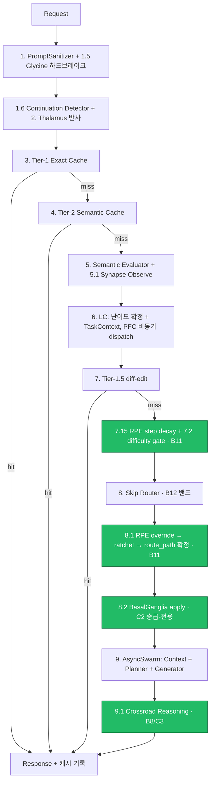

# CORTEX 5.0 OVERTURE — 아키텍처 정본

> CORTEX-AEV Core **v0.7** 위에서 **CORTEX 5.0 OVERTURE (v1.0)**로 끌어올린 인지형 실행
> 런타임의 공식 아키텍처 문서. 본 문서의 모든 수치·목록·버전은 코드·git·pip·pytest에서
> 직접 실측한 값이다(추측 없음; 불확실은 명시). 진행 로그는
> [OVERTURE_VERSION_HISTORY.md](../OVERTURE_VERSION_HISTORY.md), 통계는
> [CORTEX_5_0_OVERTURE_METRICS.md](CORTEX_5_0_OVERTURE_METRICS.md)를 참조한다. AEV 시점의
> 정본·진행 기록은 [docs/legacy/](legacy/)에 무수정 보존된다. README는 별도 갱신 예정.
>
> 기준 커밋: `58f8fc0` (2026-06-27). 측정 인터프리터: `.venv` Python 3.11.9.

---

## 0. CORTEX란 — 한 문장 정의

CORTEX-AEV는 LLM 요청을 단순 호출로 흘려보내지 않고, **입력 정제 → 의미 평가 → 난이도 기반
라우팅 → 비동기 다중 에이전트 실행 → 목표 기억 → 보상예측오차(RPE) 학습 → 행동 후보 조언**까지
거치는 **인지형 실행 런타임(cognitive orchestration runtime)**이다. 생물학적 인지 구조(시상·기저핵·
전전두엽·도파민·노르에피네프린·교세포 등)를 소프트웨어 기관(organ)으로 모델링하여, 각 요청을
"반사 → 평가 → 학습"의 신경 경로처럼 처리한다.

**OVERTURE(CORTEX 5.0)**는 이 골격을 v1.0 feature-complete로 완성한 업그레이드 트랙이다. 핵심
원칙은 **정직성 불변식 — "live가 아니면 live처럼 보이게 하지 않는다 / 신호를 발명하지 않는다"** —
이며, 모든 학습·조언 신호는 실제 런타임 관측에서만 도출된다.

---

## §1. 기관/기능 전수 (AEV 기존 vs OVERTURE 신규)

분류 근거는 **파일 최초등장 커밋**(`git log --diff-filter=A`)이다. 경계는 OVERTURE A-트랙 시작
커밋 `52ae395`(2026-06-10): 그 이전 도입 = **AEV 기존**, 이후 도입 = **OVERTURE 신규**.

### 1.1 OVERTURE 신규 기관 (13개 모듈)

전부 OVERTURE B/C 트랙(2026-06)에서 신규 도입되었다.

| 기관 | 모듈 경로 | 역할 | 트랙 |
|---|---|---|---|
| Difficulty Store | `app/rpe/difficulty_store.py` | (카테고리×난이도) 35칸 RPE 학습 가중치 저장소 | B11 |
| Difficulty Gate | `app/rpe/difficulty_gate.py` | 학습된 칸을 시냅스 스냅샷에 read-only 오버레이 | B11 |
| Difficulty Learner | `app/rpe/difficulty_learner.py` | 35칸 학습 1스텝 오케스트레이션 | B11 |
| RPE Route Override | `app/routing/rpe_route_override.py` | 학습 가중치로 skip_router 물리 경로 밴드 ±1 이동 | B11 S3a |
| Routing Ratchet | `app/routing/routing_ratchet.py` | 세션 내 단조 no-demote floor(B12 baseline 보호) | B11 S4 |
| Routing Decay | `app/routing/routing_decay.py` | idle 칸의 시간 망각 → 래칫 floor 단계 해제 | B11 S5 |
| RPE Record Store | `app/rpe/record_store.py` | mutation 레코드 aiosqlite 영속 | B3 |
| RPE Preset Store | `app/rpe/preset_store.py` | 글로벌 EMA 프리셋 영속(세션 간 학습 이월) | B3 |
| Rollback Scheduler | `app/rpe/rollback_scheduler.py` | AsyncIOScheduler 기반 mutation 자동 rollback | B4 |
| Glymphatic Cleaner | `app/maintenance/glymphatic.py` | 주기 나이-기반 캐시/레코드 청소(순수 삭제, no-LLM) | B9 |
| Crossroad Reasoner | `app/routing/crossroad.py` | 막상막하 라우팅 밴드에서 인접 밴드 background explore | B8 |
| RPE Recent Counter | `app/rpe/recent_counter.py` | 최근 RPE 결과 부호 카운터(BG 입력용) | B10 |
| Cache Key | `app/ingress/cache_key.py` | mode/slot 네임스페이스 캐시 키 정규화 | A1 |

### 1.2 AEV 기존 기관 — OVERTURE에서 배선·활성화·재설계

AEV에서 모듈은 존재했으나, OVERTURE에서 production 배선·게이트 활성화·재설계가 이루어졌다.

| 기관 | 모듈 경로 | AEV 최초 | OVERTURE 변화 |
|---|---|---|---|
| BasalGanglia Advisor | `app/basal_ganglia/*` | 2026-05-26 (read-only) | B7 배선 → B10 신호 → 점수식 재설계 → **C2 apply 활성화(승급-전용)** |
| Synapse (7칸) | `app/synapse/*` | 2026-05-16 | B2 死 stub(`weights.py`) 폐기 — RPE active mutation이 정본 updater |
| RPE Core | `app/rpe/{dopamine,service,pipeline,calculators,mutators,sources,models,ifom_store}.py` | 2026-05-24~25 | B5 observe/active 게이트 분리 · B13 관측 보상 신호 복원 |
| Tier-1.5 | `app/routing/tier1_5.py` | 2026-05-11 | B1 diff-edit 실행 구현(stub → 주입 client, live-only) |
| LC · PFC · Skip Router · Evaluator | `app/routing/{lc,pfc,skip_router,semantic_evaluator}.py` | 2026-05-11~23 | RPE override/ratchet/decay 삽입, BG apply 소비 |
| Slot Registry · Protocol Adapters | `app/core/slot_registry.py`, `app/execution/protocol_adapters/*` | 2026-05-31 (전이기) | A3 벤더-중립 디스패치 입증 |

### 1.3 순수 AEV 골격 (OVERTURE 무변경 핵심)

다음 기관은 AEV에서 확립되어 OVERTURE에서 구조 변경 없이 유지된다.

- **Ingress(반사·정제):** PromptSanitizer, Thalamus, Exact Cache(Tier-1, SQLite), Semantic Cache(Tier-2, ChromaDB)
- **Routing — 평가·신경조절(`app/routing/`):** Semantic Evaluator, LC, PFC, Skip Router(§1.2 참조) 외에:
  - **Continuation Detector** — 대화 연속 판별(세션 goal 맥락)
  - **Cue Classifier** — 다국어 cue 분류(PFC·Continuation에 주입; 현재 한/영)
  - **Centroid Store** — 카테고리 centroid(Evaluator 난이도/카테고리 산출 근거; lifespan 빌드)
  - **Neuromodulators** (`neuromodulators.py`) — 생물학적 변조 3종:
    - **Epinephrine(에피네프린)** — 고연산 게이트 cascade(카테고리+신뢰도) → 모델 tier 상향(`decide()`, LC 소비). **별도로** route_path가 full_pipeline이면 `epinephrine_active`(limit-break)로 ContextAgent 카테고리 범위 확장(B11 S3b·C2 재유도). *두 메커니즘 공존.*
    - **Norepinephrine(노르에피네프린)** — `difficulty≥4` 발동 → 생성 파라미터 변조(temperature 0.1 이하 고정, top_k 확장). 순수 bool(연속값은 §1.5 재점검 대상).
    - **Glycine(글리신)** — pre-flight 하드브레이크: token budget / rate limit / loop 3가드, 첫 실패에서 즉시 차단.
- **Execution(비동기 실행):** AsyncSwarm, Context Agent, Planner Agent, Generator Agent, GABA(Context 마스킹 필터), Category Selector, ChromaDB Searcher, LLM Client Factory(mock/live)
- **Memory(목표 기억):** Goal, Goal Stack, IFOM, Session Goal Context, Store
- **Maintenance:** PLC(per-trace 잠금)
- **Core:** e5 Embedder, Spinal Logger, Errors, Model Tier, Settings, Lock Manager
- **DB/API:** aiosqlite, FastAPI routes, Pydantic schemas

### 1.4 게이트 상태 (실측 — `app/core/config.py` 기본값)

OVERTURE C 트랙은 학습·조언 기관의 동결/활성을 측정 근거 위에서 확정했다.

| 기관 | 상태 | 게이트 플래그(기본값) |
|---|---|---|
| RPE 35칸 난이도 학습 | ✅ **활성** (C1) | `rpe_difficulty_learning_enabled=True` |
| Crossroad Reasoning | ✅ **활성** (C3) | `cr_enabled=True` — 안정 모드 + **PFC-directed explore 모드 둘 다 live**(B10 신호 + C4 확장) |
| BasalGanglia apply | ✅ **활성** (C2) | `bg_apply_enabled=True` — **승급-전용(promote-only)** |
| RPE 7칸 synapse observe/active | ❄️ 동결 | `observe_enabled=active_enabled=False` |
| Glymphatic Cleaner | ⬜ opt-in(off) | `glymphatic_enabled=False` |

**알려진 부채(정직 명시):**
- **LC 연속값 부재:** Norepinephrine은 연속 ne_level이 없는 순수 bool(`difficulty>=4`). BG는 이를
  faithful하게 {0,1}로 surface한다(발명 0). 연속값 재설계는 공개 후 별도 트랙(§1.5 기관 재점검).
- **BG/CR 강등 미적용:** BG apply는 승급만(강등 추천 무시), CR은 탐색·학습만 — 강등 적용은
  데이터 축적 후 후속.
- **ADR-014 Conflict Resolution(중재) 미구현:** mutation/조언 충돌 중재 organ은 deferred(ADR-014).
  Crossroad Reasoning(갈림길 explore)과는 별개 기관이다.
- **다국어 미지원:** Cue Classifier는 현재 한/영만 분류(그 외 언어 부채, 별도 ADR).
- **PLC per-trace 잠금:** 전역 락 부재 — Glymphatic 동시성은 스케줄러 `max_instances=1`로 가드.
- **pfc_stub deprecated 잔존:** LC가 호환 shim(`notify_pfc`)을 아직 import(제거 예정).

**공개 직전 해소된 부채(C4):**
- **무한 성장 스토어(no-GC):** SynapseStore·difficulty 스토어(PresettedDifficultyStore)에 세션/셀
  단위 **bounded LRU** 도입(routing_ratchet 패턴). evict된 셀은 글로벌 EMA 프리셋으로 graceful
  fallback. 8GB 호스트 메모리 경계 확보.
- **CR PFC-directed explore:** B10이 routes-PFC 불확실 신호를 surface했고, C4가 이를 **임의 cue의
  저신뢰(confidence < 0.6)**로 확장 — 탐색 모드가 실제 가동(경계 매치 포함, 신호 발명 0).

---

## §2. 설치된 시스템 / 의존성 (버전 + 용량)

### 2.1 핀된 직접 의존성 (pyproject SSOT, `.venv` Python 3.11.9)

재현 빌드를 위해 직접 의존성은 lock 인터프리터의 실설치 버전으로 `==` 고정된다.

| 패키지 | 버전 | 패키지 | 버전 |
|---|---|---|---|
| Python | 3.11.9 | sentence-transformers | 5.5.1 |
| fastapi | 0.136.3 | chromadb | 1.5.9 |
| uvicorn[standard] | 0.48.0 | pydantic | 2.13.4 |
| aiosqlite | 0.22.1 | pydantic-settings | 2.14.1 |
| httpx | 0.28.1 | python-dotenv | 1.2.2 |
| apscheduler | 3.11.2 | — | — |
| **(dev)** pytest | 9.0.3 | pytest-asyncio | 1.4.0 |
| **(transitive)** torch | 2.12.0 | transformers | 5.9.0 |

PyTorch는 sentence-transformers를 통해 **transitive 설치**된다(직접 핀 아님). `google-genai`·
`tiktoken`은 legacy 그룹으로 강등되어 현행 런타임에 설치되지 않는다.

### 2.2 용량 (실측)

PowerShell .NET 파일-바이트 합산 기준(content; disk-allocated 아님).

| 항목 | 크기 |
|---|---|
| **`.venv` site-packages 전체** | **1,365.7 MB (~1.33 GB)** |
| └ torch | 496.3 MB |
| └ scipy | 116.5 MB |
| └ transformers | 90.7 MB |
| └ onnxruntime | 40.7 MB |
| └ numpy | 33.0 MB |
| └ tokenizers / chromadb / sentence_transformers / safetensors | 7.4 / 5.6 / 4.1 / 0.8 MB |
| **e5 임베딩 모델** (`intfloat/multilingual-e5-base`, `model.safetensors`) | **1,112,201,288 B (~1.06 GiB)** |
| 모델 임베딩 차원 | 768 |

**총 런타임 풋프린트 ≈ 1.33 GB(패키지) + 1.06 GB(e5 모델) ≈ 2.4 GB.** torch가 패키지의 약 36%를
차지한다. (HF 캐시 디렉토리 du는 ~937 MB로 측정되나 symlink/blob 회계 차이가 있어, 권위 수치는
safetensors 파일 바이트로 한다.)

---

## §3. 구동 방법

> 모든 비밀 키는 환경변수 **이름**으로만 주입되며, 본 문서·코드·캐시 어디에도 키 **값**은 없다.

**설치 (재현 빌드):**
```
python3.11 -m venv .venv
.venv/Scripts/pip install -e ".[dev]"
```
(pyproject가 단일 진실 공급원(SSOT)이다. 구 `requirements.txt`는 OVERTURE A4에서 삭제되었다.)

**기동:**
```
uvicorn app.main:app --host 0.0.0.0 --port 8000 --reload
```

**LLM 모드:** 환경변수 `CORTEX_LLM_MODE` — 기본 `mock`, `live`로 전환. (mock/live 분리는 factory
책임이며 라우팅 로직과 무관하다.)

**게이트 환경변수** (pydantic-settings가 필드명을 env로 자동 매핑):

| 환경변수 | 기본값 | 의미 |
|---|---|---|
| `BG_APPLY_ENABLED` | True | BasalGanglia 승급-전용 apply |
| `CR_ENABLED` | True | Crossroad Reasoning explore |
| `RPE_DIFFICULTY_LEARNING_ENABLED` | True | 35칸 RPE 난이도 학습 |
| `GLYMPHATIC_ENABLED` | False | 주기 청소(opt-in) |
| `RPE_ROLLBACK_TIMEOUT_S` | 300 | mutation 잠정 유지 시간 |

슬롯별 LLM API 키는 `config/tier_slots.json`의 `api_key_env`가 지정하는 env 이름으로 `.env`에서
주입된다.

**lifespan startup 순서** (`app/main.py`): 글로벌 EMA 프리셋 로드(B3b) → AsyncIOScheduler 기동(B4) →
Glymphatic 주기 잡 등록(B9) → e5 가중치 warmup(Semantic Cache) → CentroidStore 빌드(70 시드 임베딩).
shutdown: 스케줄러 정지 + Semantic Cache 핸들 해제.

---

## §4. 처리 흐름

게이트 활성 후 정상 요청 경로(`app/api/routes.py` 실측 순서). 녹색 단계는 OVERTURE 게이트 기관이다.



**단계 설명(요지):**
1. **반사·정제:** Sanitizer가 입력을 정제하고, Glycine 하드브레이크가 위험 입력을 즉시 차단한다.
2. **연속성·시상:** Continuation Detector가 대화 연속을 판별하고, Thalamus가 반사 응답을 시도한다.
3. **캐시:** Tier-1(정확) → Tier-2(의미) 캐시를 순차 조회한다(mode/slot 네임스페이스 격리).
4. **평가·라우팅:** Semantic Evaluator가 임베딩으로 난이도/카테고리를 산출하고, LC가 TaskContext를
   확정하며 PFC를 비동기 dispatch한다.
5. **OVERTURE 학습 라우팅(B11):** RPE step decay·difficulty gate가 학습된 (카테고리×난이도) 칸을
   반영하고, Skip Router(B12 5단계 난이도→3밴드)가 물리 경로를 정한 뒤, RPE override가 밴드를
   조정하고 ratchet이 no-demote floor를 적용한다.
6. **BG apply(C2):** route_path 확정 후, BasalGanglia가 실 신호(시냅스·PFC·NE·RPE) 기반 compute-demand
   매칭으로 경로를 **승급-전용**으로 조정한다(강등 불가 → baseline 보호).
7. **실행·탐색:** AsyncSwarm이 Context/Planner/Generator를 비동기 실행하고, Crossroad Reasoning이
   막상막하 밴드에서 background explore로 학습을 보강한다.

연속(continuation) 경로는 5~9.1 단계를 동일하게 미러하되, Tier-1.5는 강제 skip한다(연속 bypass 규약).

---

## §5. 개선 가능성 및 미래 비전

> 본 절은 프로젝트 책임자의 로드맵 서술이다(설계 의도·전략 방향).

**1. 기관 재점검·고도화.** Thalamus, Tier-1.5, Norepinephrine 등 AEV 시절에 도입된 기관들의 재점검
및 보수, 또는 고도화를 예정한다.

**2. B2B 라이선스.** 공식 B2B 라이선스는 MSA 개발·라이선스 가격 책정·개발자 리소스 이슈로 아직
미정이다. 일단 오픈소스 공개만 진행한다.

**3. 경량화 버전.** 현재 버전은 처리 과정이 다소 느려, 경량화 버전도 고려한다.

**4. MSA 개발 (CORTEX Suite 구상).** Core는 차갑고 안정적으로 유지하고, 기능별 마이크로서비스로
확장한다.
- **CORTEX Lens — 멀티모달 artifact ingestion.** 파일·이미지·표를 Evidence Packet + Vector Memory로
  변환한다. Core는 요약과 참조 ID만 수신하며, 비동기 처리로 Core를 무차단(non-blocking) 유지한다.
- **CORTEX Mirror — 페르소나·인터페이스 정렬.** 말투·구조·대화 온도를 조율하되, 사실·안전·라우팅
  판단은 Core가 유지한다(분리 필수). opt-in·auditable·disable 가능해야 한다.
- **CORTEX Atlas — 기업 지식 시딩(B2B).**
- **CORTEX NeuroScope — 관측성·리플레이·분석.**
- **CORTEX Relay — 모델 라우팅·벤더 추상화.**
- **CORTEX Sentinel — 보안·정책 가드레일.**
- **CORTEX Go — 일반 사용자용 경량 래퍼.** 최후순위이며, 운영·과금·abuse 방지가 선행되어야 한다.

**5. 타 하네스 엔지니어링 계열 오픈소스 프로젝트**를 차후 계획 중이다.
